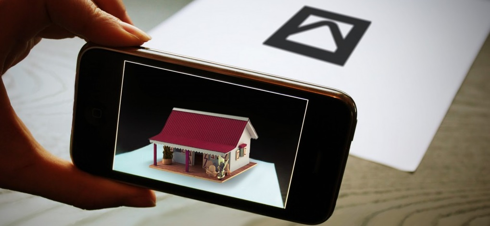
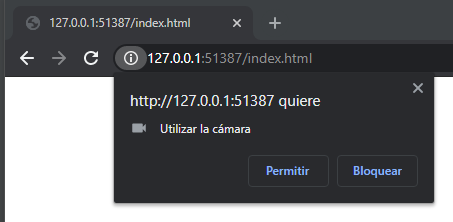
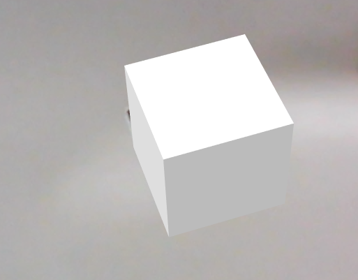

> Esta introducción acerca de AR.js la traduje, con algunas variantes, de la documentación oficial de [AR-js-org](https://ar-js-org.github.io/AR.js-Docs/).

__AR.js__ es una biblioteca liviana para Realidad Aumentada en la Web, que viene con características como seguimiento de imágenes, AR basado en ubicación y seguimiento de marcadores.

La realidad aumentada es la tecnología que permite agregar contenido superpuesto en el mundo real. Se puede proporcionar para varios tipos de dispositivos: de mano (como teléfonos móviles), visores de Realidad Virtual, computadoras de escritorio, etc.

Para dispositivos móviles, la ‘realidad’ se captura desde la cámara y luego se muestra en la pantalla del dispositivo, agregando contenido 3D sobre la imagen.

Desarrollar Realidad Aumentada (‘AR’ de ahora en adelante) en la Web, significa reutilizar tecnologías conocidas como Javascript, HTML y CSS, conocidas por muchos programadores y posiblemente diseñadores.

Básicamente, es posible lanzar cada nueva versión al instante, corregir errores o lanzar nuevas funciones casi en tiempo real, abriendo muchas posibilidades prácticas.

Para los usuarios, significa llegar a una experiencia AR simplemente visitando un sitio web. Como los códigos QR ahora están muy extendidos, también es posible escanear un código QR y llegar a la URL sin siquiera escribir. Además, los usuarios no tienen que reservar espacio de almacenamiento para una app AR.

### Índice 
- [Por qué AR.js](#por-qué-arjs)
- [Tipos de AR](#tipos-de-ar)
- [Puntos clave](#puntos-clave)
- [Requisitos](#requisitos)
- [Implementar siempre en _https_](#implementar-siempre-en-https)
- [Realidad Virtual con marcadores](#realidad-virtual-con-marcadores)
  - [Tomar en cuenta:](#tomar-en-cuenta)
- [Marcadores personalizados](#marcadores-personalizados)
- [La plantilla](#la-plantilla)
- [Texturas](#texturas)
- [Otros atributos](#otros-atributos)
- [Animar](#animar)
- [Fondos](#fondos)
- [Modelos 3D externos](#modelos-3d-externos)

## Por qué AR.js

__World Wide Web__ es un entorno colaborativo y accesible. La tecnología de Realidad Aumentada, como un nuevo medio de comunicación, puede ayudar a las personas a ver la realidad de formas nuevas y emocionantes: se usa todos los días para muchas aplicaciones útiles, desde arte hasta educación, y también por diversión. 

Una tecnología tan poderosa puede ayudar a las personas y aprovechar su creatividad, y debería ser gratuita de alguna manera. Esta biblioteca fue escrita por Jerome Etienne para llevar AR a la Web, como una tecnología gratuita y de código abierto. Tiempo después fue retomada por un grupo de programadores para continuar su desarrollo, y es esta nueva versión la que usaremos. 

## Tipos de AR 

__AR.js__ presenta los siguientes tipos de Realidad Aumentada, en la Web: 

- _Seguimiento de imagen_ , cuando la cámara encuentra imágenes en 2D, es posible mostrar algún tipo de contenido encima o cerca de ella. El contenido puede ser una imagen 2D, un GIF, un modelo 3D (también animado) y un video 2D también. Casos de uso: Arte aumentado, aprendizaje (libros aumentados), volantes aumentados, publicidad, etc. 

- _AR basado en la ubicación_, este tipo de AR utiliza lugares del mundo real para mostrar contenido de Realidad Aumentada en el dispositivo del usuario. Las experiencias que se pueden construir con esta biblioteca son aquellas que utilizan la posición de los usuarios en el mundo real. El usuario puede moverse (idealmente al aire libre) y, a través de sus teléfonos inteligentes, puede ver el contenido de AR en lugares del mundo real. Moverse y rotar el teléfono hará que el contenido de AR cambie de acuerdo con la posición y rotación de los usuarios (por lo que los lugares se ‘pegan’ en su posición real y aparecen más grandes / más delgados según su distancia del usuario). Con esta solución, es posible crear experiencias como soporte interactivo para guías turísticos, soporte al explorar una nueva ciudad, encontrar lugares de interés como edificios, museos, restaurantes, hoteles, etc. 

- _Seguimiento de marcadores_: cuando la cámara encuentra un marcador, es posible mostrar algún contenido (igual que el seguimiento de imágenes). Los marcadores son muy estables pero limitados en forma, color y tamaño. Se sugiere para aquellas experiencias donde se requieren muchos marcadores diferentes con contenido diferente. Ejemplos de uso: (libros aumentados), volantes aumentados, publicidad. 

## Puntos clave 

Esta biblioteca tiene muchas ventajas, en comparación a los programas comerciales: 

- *Es muy rápida*: funciona de manera eficiente, incluso en teléfonos de gama media. 

- *Basado en la web*: es una solución web pura, por lo que no requiere instalación. Es JavaScript basado en three.js + A-Frame + jsartoolkit5 

- *Código abierto*: es completamente de código abierto y gratuito 

- *Usa tecnoñogía estandarizada*: funciona en cualquier teléfono con __webgl__ y __webrtc__ 

## Requisitos 

Algunos requisitos y restricciones conocidas se enumeran a continuación: 

- Funciona en todos los teléfonos con webgl y webrtc. 

- La RA basada en marcador es muy ligera, mientras que la basada en seguimiento de imágenes consume más CPU. 

- En dispositivos con cámaras múltiples, Chrome puede tener problemas para detectar la correcta. Se recomienda utilizar Firefox si se encuentra que __AR.js__ se abre en la cámara incorrecta. 

- Para trabajar con la función basada en ubicación, el teléfono debe tener sensores GPS. 

- La función basada en la ubicación solo está disponible usando la versión __A-Frame__, no la que utiliza __Three.js__. 

## Implementar siempre en _https_ 

El acceso a la cámara del teléfono o a los sensores GPS de la cámara, debido a las principales restricciones de los navegadores, solo se puede hacer en los sitios web con protocolo seguro __https__. 

Todos los ejemplos mostrados en esta página, y todas las aplicaciones web de __AR.js__ en general, deben ejecutarse en un servidor web. Puedes usar un servidor local para hacer las pruebas en tu computadora, como el que genera __Visual Studio Code__ con el complemento _Live Server_. En la aplicación __VS Code__ se debe abrir la carpeta del proyecto (folder raíz) del sitio web que vamos a desarrollar. 

## Realidad Virtual con marcadores 

Este artículo se centrará en el uso de marcadores para visualizar Realidad Aumentada, por ser la forma más fácil de entrar a esta técnica. Un marcador se reconoce por tener un marco cuadrado, y dentro de él un símbolo, logotipo o letra. Debe ser un diseño sencillo, sin muchos detalles, para que funcione de manera óptima. 

Los marcadores pueden ser de tres tipos diferentes: 

- Hiro 
- Código de barras 
- Patrón. 

Para obtener más información sobre los marcadores, lea estos artículos: 

- Tutorial básico basado en marcadores de __AR.js__ y explicación de marcadores 
- Ofrezca experiencias __AR.js__ utilizando solo __QRCodes__ (marcadores dentro de QRCodes)

### Tomar en cuenta: 

- __Hiro Marker__ es el predeterminado, y el que usaremos. Tiene ese nombre por [Hirokazu Kato], que en 1999 desarrolló [__ARToolKit__] 

- *Marcadores de código de barras* son generados automáticamente a partir de cálculos matriciales. Si necesita la lista completa de marcadores de código de barras, [aquí está] 

- Los marcadores de patrón son personalizados, creados a partir de una imagen (muy simple, alto contraste), cargados por el usuario. 

 
_Marcador Hiro_. Copia e imprime esta imagen. 


Códigos de barras usados en ARToolKit


Marcador personalizado

## Marcadores personalizados 

Los marcadores tienen un borde negro y formas de alto contraste. Aquí está un artículo sobre elegir imágenes adecuadas para generar marcadores personalizados, llamado [10 tips to enhance your __AR.js__ app](https://medium.com/chialab-open-source/10-tips-to-enhance-your-ar-js-app-8b44c6faffca).

También hice una presentación sobre cómo generar marcadores personalizados, que puedes visitar en [https://franciscoestrada.github.io/marker/](https://franciscoestrada.github.io/marker/) 

## La plantilla 

Para empezar, descarga la carpeta comprimida que usaremos en el tutorial:
 
[](https://franciscoestrada.mx/Realidad-Aumentada.zip) [Realidad-Aumentada.zip](https://franciscoestrada.mx/Realidad-Aumentada.zip)


Descomprímela, abre tu editor de código favorito y selecciona en el menú __Archivo>Abrir carpeta…__ 


Al abrir __index.html__, encontrarás el siguiente código:

``` html
<!DOCTYPE html>
<html lang="es">
<head>
    <script src="https://aframe.io/releases/1.4.0/aframe.min.js"></script>
    <script src="https://raw.githack.com/AR-js-org/AR.js/master/aframe/build/aframe-ar.js"></script>
   </head> 
   <body style="margin : 0px; overflow: hidden;">
        <a-scene embedded arjs>
        <a-marker preset="hiro">
            <a-box></a-box >
        </a-marker>
        <a-entity camera></a-entity>
        </a-scene>
    </body>
</html>

```

En la línea 3 encontramos el vínculo hacia la biblioteca __A-Frame__.

En la línea 4 establecemos un enlace a la biblioteca de __AR.js__, en específico a __aframe-ar.js__. Esto se debe a que __AR.js__ maneja dos variantes, una especializada en __A-Frame__ y otra basada en __Three.js__. 

La línea 5 agrega Estilos en Cascada a la etiqueta __body__ para eliminar los márgenes por defecto en la página y evitar que el contenido rebase los bordes de la ventana, sin que aparezcan barras deslizantes (sliders). 

A continuación, en la línea 6 tenemos el inicio de una escena con la estructura de A-Frame a la que se le agrega un atributo para reconocer la biblioteca de __AR.js__ `<a-scene embedded arjs>` 

Anidada dentro de la escena, en la línea 7, se agrega la etiqueta `<a-marker preset="hiro">`, que indica el marcador que usaremos, en este ejemplo, Hiro. La imagen con la palabra __Hiro__ dentro de un marco negro, se encuentra unos párrafos arriba, y también en la carpeta __imagen__ del folder raíz. Se debe imprimir para visualizar el ejemplo de Realidad Aumentada, o en su defecto, abrirla en el teléfono y mostrarla a la cámara web de la computadora. 

La línea 8 muestra la apertura y cierre de la etiqueta `<box></box>`, que genera el modelo tridimensional de un cubo. Como no se le agregaron atributos, tendrá color blanco y medirá un metro por lado. 

La siguiente línea de código contiene el cierre de la etiqueta `</marker>`, mientras que en la línea 10 activamos la cámara web que usaremos en esta escena con el comando `<a-entity camera></a-entity>`. 

Las últimas líneas son los cierres de la escena de __A-Frame__, el cuerpo y el html, respectivamente. Al previsualizar la página generada usando la extensión __Live Server__ de _Visual Studio Code_ se abre una ventana de navegador que pedirá activar la cámara web. 



Después de aceptar, mostramos a la cámara la imagen impresa del marcador __Hiro__. A falta del impreso, se puede mostrar a la cámara la imagen desde un celular. Sobre el marcador se mostrará el modelo 3D de un cubo de color blanco. Al mover y girar el marcador Hiro, el cubo seguirá los movimientos. 



## Texturas 

Para añadir una imagen que funcione como textura, se agrega como un recurso (__assets__) a la escena, que se precargará en la memoria de la computadora. Para ello, se inserta la etiqueta `<a-assets></a-assets>` y anidada dentro de ella, una etiqueta `` con la ubicación del archivo y un __id__ para asignarle un nombre, como se muestra en las líneas 6 a 8.

A continuación, se agrega el atributo src a la etiqueta box, indicando el nombre dado a la textura que se utilizará, antecedido por el signo #, como vemos en la línea 10.


``` html
<!DOCTYPE html>
<html lang="es"><head>
    <script src="https://aframe.io/releases/1.0.0/aframe.min.js"></script>
    <script src="https://raw.githack.com/AR-js-org/AR.js/master/aframe/build/aframe-ar.js"></script>
   </head> <body style="margin : 0px; overflow: hidden;">
        <a-scene embedded arjs>
        <a-assets>
            
        </a-assets>
        <a-marker preset="hiro">
            <a-box src='#textura'>
            </a-box>
        </a-marker>
        <a-entity camera></a-entity>
        </a-scene>
    </body>
</html>

```
En la carpeta imagen del fólder raíz encontrarán varias texturas para que prueben con ellas.

## Otros atributos
Además de la textura, se pueden modificar otras características de los objetos 3D: posición, rotación, opacidad, ancho, altura, profundidad, color, etc...

``` html
<!DOCTYPE html>
<html lang="es"><head>
    <script src="https://aframe.io/releases/1.0.0/aframe.min.js"></script>
    <script src="https://raw.githack.com/AR-js-org/AR.js/master/aframe/build/aframe-ar.js"></script>
   </head> <body style="margin : 0px; overflow: hidden;">
        <a-scene embedded arjs>
        <a-assets>
            
        </a-assets>
        <a-marker preset="hiro">
            <a-box position='0 1 0' src='#textura' material='opacity: 0.5;' color='tomato' depth='1' height='1' width='1' rotation="45 0 45">
            </a-box>
        </a-marker>
        <a-entity camera></a-entity>
        </a-scene>
    </body>
</html>

```

Se puede notar que el color y la transparencia interactúan con la textura del el objeto.

## Animar
La mayoría de los atributos de los modelos 3D se pueden animar. En este ejemplo se agregará un giro continuo al cubo usando la etiqueta a-entity que se usará para animar la propiedad rotation, indicando cuántos grados y en cual eje. 

La notación de tres números 0 360 0 (x, y y z), indica que se girará 360 alrededor del eje y.

``` html
<!DOCTYPE html>
<html lang="es"><head>
    <script src="https://aframe.io/releases/1.0.0/aframe.min.js"></script>
    <script src="https://raw.githack.com/AR-js-org/AR.js/master/aframe/build/aframe-ar.js"></script>
   </head><body style="margin : 0px; overflow: hidden;">
        <a-scene embedded arjs>
        <a-assets>
            
        </a-assets>
        <a-marker preset="hiro">
           <a-entity rotation="0 0 0" animation="property: rotation; to: 0 360 0; loop: true; dur: 10000">
                <a-box position='0 1 0' src='#textura'></a-box>
            </a-entity>
        </a-marker>
        <a-entity camera></a-entity>
        </a-scene>
    </body>
</html>

```

Esta etiqueta (líneas 11 y 13) rodea al cubo, que se encuentra en la línea 12.

## Fondos
Un complemento de A-Frame nos da la posibilidad de agregar un entorno procedimental que genera entornos visuales sin necesidad de imágenes, utilizando código. Para información sobre los diferentes parámetros que se pueden modificar, visiten el sitio del programador: https://github.com/feiss/aframe-environment-component


``` html
<!DOCTYPE html>
<html>
   <head>
    <script src="https://aframe.io/releases/1.0.0/aframe.min.js"></script>
    <script src="https://raw.githack.com/AR-js-org/AR.js/master/aframe/build/aframe-ar.js"></script>   
  <!--  Generación por procedimientos (procedimental en español o 'procedural' en inglés) de escenarios 3D.    -->	
	 <script src="https://unpkg.com/aframe-environment-component/dist/aframe-environment-component.min.js"></script>
   </head> 
    <body style="margin : 0px; overflow: hidden;">
        <a-scene embedded arjs>
        <a-assets>
            
        </a-assets>
<!-- Escenario procedimental 3D -->		
		 <a-entity environment="preset: egypt; dressingAmount: 1; position: 250 0 0; dressingScale: 40; seed: 3;"></a-entity>
<!-- Se agrega una luz 		 -->
		 <a-light type="ambient" color="bbb" position="0 20 0"  rotation="0 25 65"></a-light>   
        <a-marker preset="hiro">
           <a-entity rotation="0 0 0" animation="property: rotation; to: 0 360 0; loop: true; dur: 10000">
                <a-box position='0 1 0' src='#textura'></a-box>
            </a-entity>
        </a-marker>
        <a-entity camera></a-entity>
        </a-scene>
    </body>
</html>

```

También se agregó una luz ambiental para mejorar la iluminación del modelo. Hay que tomar en cuenta que en este caso se sustituye la vista de nuestro entorno por el escenario procedimental. De cualquier manera, se debe mostrar el marcador a la cámara para visualizar el modelo 3d.

## Modelos 3D externos

Además de generar objetos primitivos (cubo, esfera, cilindro, cono, nudo, plano), A-Frame y por extensión AR.js son capaces de importar diversos formatos de archivos 3D, como OBJ, PLY, DAE, FBX, JSON, entre otros.

Sin embargo, el formato de preferencia es glTF (GL Transmission Format) que es un formato de archivo para escenas y modelos 3D basado en el estándar JSON. Es descrito por sus creadores como el «JPEG de 3D». Es un formato ideado para la distribución eficiente e interoperable de escenas 3D que comprime el tamaño de escenas y modelos 3D, minimizando el procesamiento en tiempo de ejecución en aplicaciones que usan WebGL y otras API (1).

El formato glTF se actualizó a la versión 2 en 2017, que maneja una opción binaria, GLB, siendo ésta la más utilizada pues lleva incorporadas las texturas y es de un tamaño menor por su nivel de compresión.

En el fólder raíz encontrarán un subfólder llamado modelos3d, dentro del cual está el archivo _Island.glb_ el cual se usa en el siguiente código.

``` html
<!DOCTYPE html>
<html>
   <head>
    <script src="https://aframe.io/releases/1.0.0/aframe.min.js"></script>
    <script src="https://raw.githack.com/AR-js-org/AR.js/master/aframe/build/aframe-ar.js"></script>
    <body style="margin : 0px; overflow: hidden;">
        <a-scene embedded arjs>
        <a-marker preset="hiro">
            <a-entity
            position="0 0 0"
            rotation="-90 0 0"        
            scale="5 5 5"
            gltf-model="modelos3d/Island.glb"
            ></a-entity>
        </a-marker>
        <a-entity camera></a-entity>
        </a-scene>
        </head>
    </body>
</html>

```

La mayoría de los programas 3D tienen la opción de exportar en el formato _glTF_ y en su formato comprimido, _GLB_. De esta manera, se pueden convertir modelos en otros formatos y utilizarlos en Realidad Virtual y Realidad Aumentada.

Otro aspecto que se beneficia de este formato es la animación de personajes, pues glTF es capaz de contener la información de los movimientos que se agreguen a un personaje y objeto. Aquí hay que difernciar con la animación mencionada antes, donde se anima el giro o desplazamiento de un objeto, diferente a hacer correr, saltar o golpear a un personaje. No obstante, ambos tipos de animación se pueden combinar en un modelo 3D.

El artículo original se encuentra en mi blog [Realidad Aumentada con AR.js](https://blog.franciscoestrada.mx/2020/08/10/realidad-aumentada-con-ar-js/)

