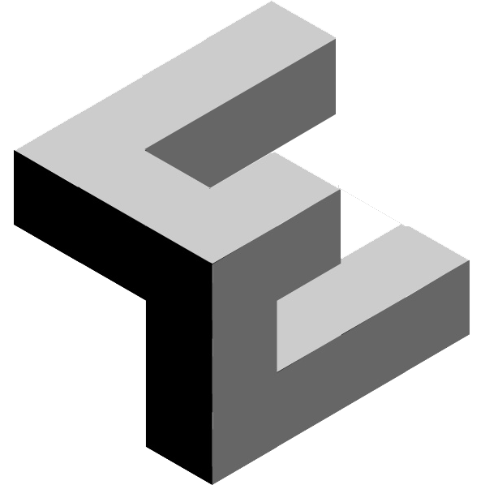
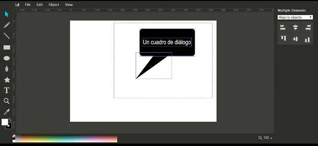

<!-- _class: lead invert-->
# <!-- fit --> Markdown

---
<!-- paginate: true -->

## ¿Qué es Markdown?

* Markdown es un lenguaje de marcado ligero usado 
  para dar formato a documentos de texto simple, creado por 
  John Gruber en 2004.
* La sintaxis de Markdown está diseñada para ser legible 
  aún sin usar un previsualizador para el documento, 
  sin usar etiquetas u otras instrucciones de formato.
* Es un archivo de texto simple con extensión **.md**
---
## ¿Porqué usar Markdown?

1. Puede ser usado para elaborar
	* sitios web
	* documentos de Word
	* PDF
	* libros electrónicos
	* mensajes de correo electrónico
	* presentaciones
	* documentación técnica y científica

---
2. Markdown es independiente de plataformas,  
   cualquier Sistema Operativo sirve
   para generar el documento.

3. A diferencia de documentos hechos con 
   aplicaciones que pueden quedar obsoletas, 
   Markdown es legible en cualquier editor de texto.

---
<!-- _class: lead invert-->
## Sintaxis de Markdown
A continuación se muestran las reglas básicas de este lenguaje de marcado y su representación al convertirlo a HTML.

---
<!-- _class: lead invert-->
### Encabezados

| HTML| Markdown |
|:---:|:--------:|
# H1    &nbsp; &nbsp;&nbsp; `# H1`
## H2   &nbsp; &nbsp; &nbsp;&nbsp; `## H2`
### H3  &nbsp; &nbsp; &nbsp; &nbsp; &nbsp; `### H3`
#### H4 &nbsp; &nbsp; &nbsp; &nbsp; &nbsp; &nbsp; `#### H4`

---
<!-- _class: lead invert-->
### Estilos
| HTML| Markdown |
|:---:|:---------|
*Itálico* | `*Itálico*`
_Itálico_ | `_Itálico_`
**Bold**  | `**Bold**`
__Bold__  | `__Bold__`
| cita    | ` > cita`

---
### Listas desordenadas
Cada ítem se inicia con un guión y espacio 
Para listas anidadas, dos espacios antes del guión 
Los dos espacios se pueden sustituir por una tabulación.

- Ítem 1  `- Ítem 1, lista desordenada`
- Ítem 2 `- Ítem 2, lista desordenada`
  - Sub ítem 1 &nbsp; `  - Subítem 1`
  
---
### Listas ordenadas
Cada ítem se inicia con un número, punto y espacio. 
Para listas anidadas, agregar dos espacios o una tabulación antes del número o guión
Se pueden combinar ambos tipos de listas 
1. Ítem 1 `1. Ítem 1`
2. Ítem 2 `1. Ítem 2`
   - Sub ítem 1 `- Sub ítem 1`

---
### Vínculos
Se crean usando dos elementos: corchetes seguidos por paréntesis. 
Los corchetes contienen el texto y los paréntesis el vínculo.

`[descripción](url)`

**Ejemplo**
`[Misión Artemisa a la Luna](https://www.nasa.gov/artemis-1)`

**Resultado**
[Misión Artemisa a la Luna](https://www.nasa.gov/artemis-1)

---

#### Vínculos con título o *tooltip*

Entre los paréntesis del vínculo se agrega un título que se muestra al colocar el cursor sobre él.

`[descripción](url "título opcional")`


**Ejemplo**

`[Buscar en Google](https://google.com/ "Ir al buscador Google")`

Resultado 
[Buscar en Google](https://google.com/ "Ir al buscador Google")

---
### Imágenes

Tiene la misma estructura que el vínculo, con la diferencia que se agrega un símbolo
de admiración al inicio, y el enlace dirige a una imagen

``

Algunas versiones de Markdown permiten indicar las dimensiones de la imagen

``

---
<!-- _class: lead invert-->
**Ejemplo**

``


---
### Imagen con vínculo

Se combinan los códigos de imagen y vínculo:

`[](url vínculo)`

---
<!-- _class: lead invert-->
**Ejemplo**

`[](http://blog.franciscoestrada.mx/inicio/)`

**Resultado**

[](http://blog.franciscoestrada.mx/inicio/)

---
### Video
<!-- _class: lead invert-->
En lugar de un sitio web, la imagen direcciona a un video.

[](https://www.youtube.com/watch?v=oa37PFUWY-8)  


---
### Bloque de código
Colocar tres acentos graves ` ``` ` al inicio y final, e indicar el lenguaje usado en el código.

``` html
``` html
<!DOCTYPE html>
<html lang="es">
<head>
    <title>Cabeza</title>
</head>
<body>
    <h1>Cuerpo</h1>
    <p>Párrafo</p>
</body>
</html>
`` `
```
---
### Código en línea de texto

Agregar un acento grave al inicio y final del código a resaltar.
&#96; `<html lang="es">` &#96;

**Ejemplo**
> Se recomienda agregar el atributo *lang="es"* a la etiqueta *<html>* de la siguiente manera `<html lang="es">`, para indicar que se usa el idioma español en la página  y evitar que el navegador sugiera traducirla.

---
## Tablas

La primera fila es el encabezado de la tabla
* Cada celda se separa con una línea vertical o *pipe* `|celda1|celda2|`
* En la segunda fila se colocan guiones para separar el encabezado
* Como opción, a los guiones se les agregan dos puntos a los extremos para indicar el alineado del contenido de las celdas:
  *  ` |-----| ` Alineado por omisión
  *  ` |:----| ` Alineado a la izquierda
  *  ` |----:| ` Alineado a la derecha
  *  ` |:---:| ` Centrado

---
**Ejemplo de tabla**
No es necesario que las líneas verticales coincidan en cada fila, al convertirse a HTML se alinearán correctamente.

```md
| Código Markdown |  HTML |
| :--------:  | :-------: |
| `*itálica*` | *itálica* |
| `_itálica_` | _itálica_ |
| `**bold**`  | **bold**  |
| `__bold__`  | __bold__  |

```
---
<!-- _class: lead invert-->
**Resultado**

| Código Markdown |  HTML |
| :--------:  | :-------: |
| `*itálica*` | *itálica* |
| `_itálica_` | _itálica_ |
| `**bold**`  | **bold**  |
| `__bold__`  | __bold__  |
 

---
### Expresiones Matemáticas

Para generar una fórmula en línea de texto, se rodea con `$...$`, y para una notación en bloque se usan signos dobles `$$...$$`

**Ejemplo 1**
`$ax^2+bc+c$`
En una línea de texto se mostrará así: $ax^2+bc+c$

---
**Ejemplo 2**


```
$$
f(x) = \int_{-\infty}^\infty
    \hat f(\xi)\,e^{2 \pi i \xi x}
    \,d\xi
$$
```
El resultado se compila de esta manera:

$$
f(x) = \int_{-\infty}^\infty
    \hat f(\xi)\,e^{2 \pi i \xi x}
    \,d\xi
$$

---
<!-- _class: lead invert-->
## Editores y Extensiones

---
### Editores en línea

- [Dillinger](https://dillinger.io/) exporta en HTML, PDF y Markdown
- [StackEdit](https://stackedit.io/app#) Exporta en HTML y Markdown
- [StackEditPro](https://stackeditpro.io/app#) Exporta en HTML y Markdown
- [Pandoc](https://pandoc.org/try/) Exporta a múltiples formatos
- [Markmap, editor en línea](https://markmap.js.org/repl) Exporta mapas mentales en HTML y SVG
- [Le PoireauKinorama](https://lolobobo.fr/poireau/index-en.html) Convierte enlaces de video HTML a su equivalente en Markdown.

---
### Extensiones para VSCode
- [Markdown All in One](https://github.com/yzhang-gh/vscode-markdown) 
Agrega atajos de teclado, autocompletar, generación de tablas de contenido y más
- [Marp](https://marp.app/) 
  Exporta presentaciones en HTML, PDF y PowerPoint
- [Markmap](https://markmap.js.org/) 
  Exporta mapas mentales en formato HTML y SVG

---
### Extensiones de Chrome
- [MD Reader](https://chrome.google.com/webstore/detail/md-reader/medapdbncneneejhbgcjceippjlfkmkg) 
  Visualiza archivos MD en línea, y locales
- [Markdown Here](https://chrome.google.com/webstore/detail/markdown-here/elifhakcjgalahccnjkneoccemfahfoa?hl=es)
   Escribir correo electrónico con Markdown. También compatible con Wordpress, Blogger, Evernote


---
<!-- _class: lead invert-->
&#169; Francisco Estrada R, 2022 


