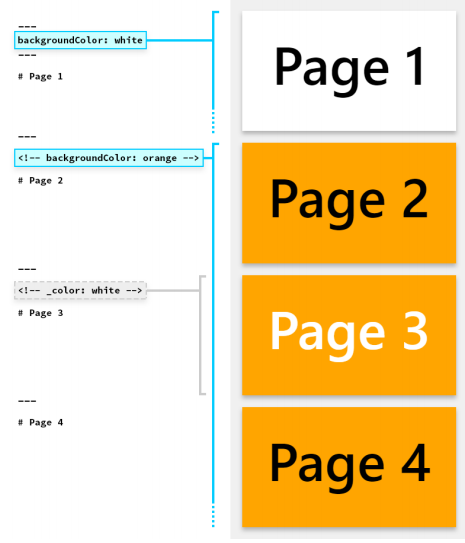
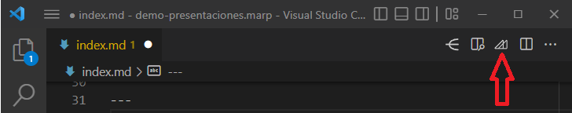
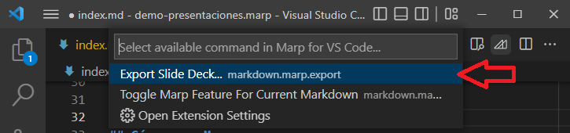

<style>
/* a {
  color: black;
} */

p, ul, ol, li{
    font-size: 0.8em;
}
</style>

# Presentaciones usando 
# Markdown y Marp

---
<!-- paginate: true -->

La extensión **Marp** de Visual Studio Code permite realizar presentaciones de diapositivas directamente desde Markdown.
<br>


---
### Cómo usar Marp

* Instala la extensión en Visual Studio Code
* Al inicio del documento Markdown, agrega tres guiones
* En la siguiente línea escribe` marp: true `
* Abajo de este texto agrega otras tres líneas
* Cada diapositiva también se separa usando tres guiones
* Usa el visor de Markdown integrado en VSCode para ver las diapositivas. El visor se actualiza con cada cambio al código

---

**Ejemplo**
Copiar el código y salvarlo con extensión **.md**
Al abrirlo en VS Code y activar la ventana de previsualización, se verá una presentación con tres diapositivas.
<br>

``` md 
---
marp: true
---
# Diapositiva 1
---
# Diapositiva 2
---
# Diapositiva 3
```
---
### Directivas
Marp tiene una sintaxis llamada **"DIrectives"**
para modificar las presentaciones. Se colocan entre tres guiones `---` al inicio del documento

``` md
---
marp: true
---
```

O como un comentario HTML en cualquier parte del archivo
`<!-- theme: default -->`

---
### Directivas globales
- `theme:` para elegir un tema
- `size:` dos proporciones 16:9 y 4:3
<br>

  ``` md
  ---
  theme: gaia
  size: 16:9
  ---
  ``` 

Marp cuenta con tres temas: `default`, `gaia` y `uncover` 

---
### Directivas locales
Son ajustes aplicados a diapositivas individuales.

- `paginate:` muestra la numeración de las diapositivas
- `header:` especifica el contenido del encabezado
- `footer:` agrega contenido al pie de página
- `class:` aplica clases CSS
- `color:` define el color del texto
- `backgroundColor:` coloca un color al fondo

---
#### Directivas puntuales

Las directivas locales se aplican a **la diapositiva definida y las subsecuentes**
Para aplicarlas a una sola, se utiliza un guión bajo como `_class`

---
#### Ejemplo
<!-- _color: tomato  -->
Esta página está usando un color de texto diferente a las otras diapositivas.

`<!-- _color: tomato  -->`

---
### Imagen
Redimensionar y aplicar filtros con CSS

``
``


---
### Imagen de fondo
Se aplica una imagen de fondo usando la palabra clave `bg`

``


---
### Múltiples imágenes de fondo
En Marp se pueden utilizar varias imágenes de fondo, cada una usará un porcentaje proporcional.

``` md


```


Es posible cambiar la dirección usando la opción `vertical`

---
### Dividir el fondo
Para una imagen de fondo dividida, se usan las palabras clave `bg` seguida de la ubicación, ya sea izquierda o derecha con `left` o `right`


``

---
### Lista fragmentada
Los ítems de una lista aparecerán uno a uno al sustituir los guiones por asteriscos.
* Ítem Uno
* Ítem Dos
* Ítem Tres

```md
* Ítem Uno
* Ítem Dos
* Ítem Tres
```
---
### Notación matemática
Se usa [KaTex](https://katex.org/) para representar $ax^2+bc+c$ de manera correcta, al igual que los bloques de fórmulas.
``` md
$ax^2+bc+c$

$$
f(x) = \int_{-\infty}^\infty
    \hat f(\xi)\,e^{2 \pi i \xi x}
    \,d\xi
$$
```

---

## Guardar la presentación

1. En la ventana de *VSCode* damos clic al botón de la extensión.



---

2. Se muestra una ventana con la opción *Export Slide Deck...*
3. Damos clic en esa línea



---
4. Se abre la ventana para elegir nombre, ubicación y tipo del documento a guardar.

Los tipos de formato a seleccionar son:
- PDF
- HTML
- PowerPoint
- PNG (solo la primer diapositiva)
- JPG (solo la primer diapositiva)

---
 © Francisco Estrada R, 2022